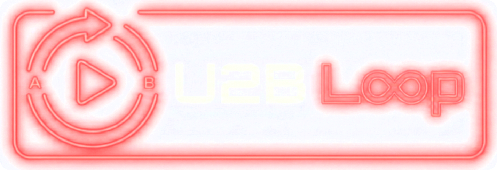

  

  YouTube・ローカル動画のAB区間ループ再生アプリ（Android）

  

---

## 機能

- **AB区間ループ再生** — 任意の区間を設定して繰り返し再生
- **複数区間（リージョン）** — 1曲に最大10個のAB区間を保存
- **YouTube / ローカル動画** — YouTube URLの貼り付け、またはローカルファイルを選択
- **波形表示** — 音声波形上でAB地点をドラッグ操作
- **プレイリスト** — 曲をまとめて連続再生・共有URL生成
- **タグ管理** — タグで曲を分類・フィルタリング
- **速度変更** — 0.25x〜2.0x
- **エクスポート** — AB区間の音声をファイルに書き出し
- **バックアップ** — JSON形式でエクスポート/インポート
- **ダーク/ライトモード** — テーマ切替対応
- **アプリ内アップデート** — GitHub Releasesから最新版を通知

## インストール

[Releases](https://github.com/kuronekorou39/u2b-loop-app/releases/latest) から最新の APK をダウンロードしてインストール。

## 技術スタック

| カテゴリ | ライブラリ |
|---|---|
| フレームワーク | Flutter |
| 状態管理 | Riverpod |
| 動画再生 | media_kit |
| YouTube解析 | youtube_explode_dart |
| データ永続化 | Hive |
| UI | Material Design 3 |

## スクリーンショット

<!-- TODO: スクリーンショットを追加 -->

## ライセンス

個人利用・APK配布のみ。ソースコードの無断転載・再配布を禁止します。
